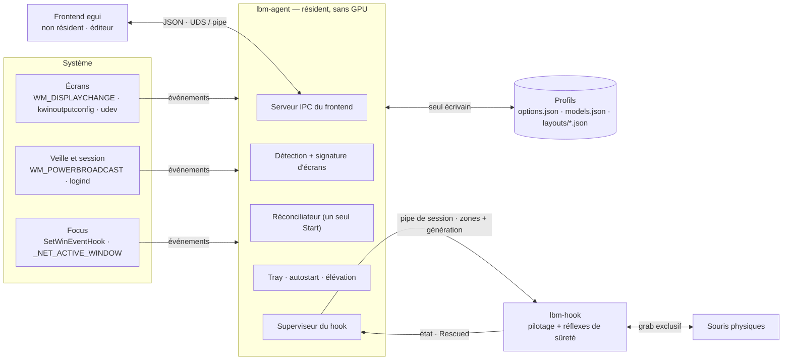
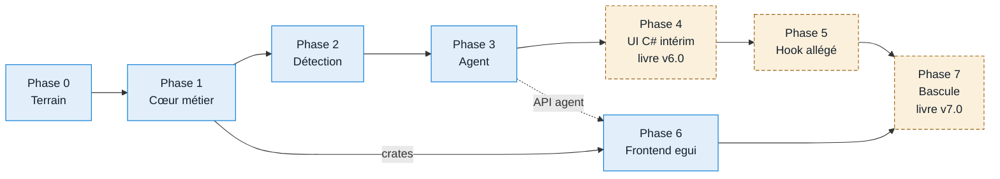

# LittleBigMouse en trois processus — plan v6

> **État** : plan du 2026-09-11, établi sur `master` `e3e7fba` et la branche
> `fix/607-stale-layout-hook`. Décisions D1 à D10 tranchées le 2026-09-11, dont D5 amendée
> (le hook survit à l'agent) ; D11 (mode service sous Windows) reportée à après la phase 0.
> Phase 0 engagée.

Frontend en Rust/egui qui ne reste pas chargé, processus résident qui surveille le système
et charge les profils, hook réduit au pilotage de la souris. Ce document donne l'avis sur ces
choix, les décisions encore ouvertes, et un plan de migration par phases fondé sur une lecture
complète du code actuel.

## Avis

Les trois choix sont bons, et le découpage corrige un défaut réel du code actuel. Aujourd'hui,
la décision d'accrocher la souris est répartie entre deux processus : le daemon Rust détecte les
changements d'écran et se décroche seul, mais ne se raccroche jamais ; l'UI C# reçoit
l'événement, reconstruit le layout et renvoie un Start par l'un de trois chemins concurrents
(réveil, watchdog de reprise, reconstruction). C'est exactement le terrain de #607. Un processus
résident unique, qui voit tous les événements et prend toutes les décisions, supprime cette
classe de bugs par construction.

- **Frontend egui non résident — d'accord.** Supprime le runtime .NET (l'installeur le
  télécharge, #510), les sous-modules HLab, la dépendance à Avalonia 12 (LiveCharts en build de
  développement) et le contrat IPC dupliqué à la main en deux langages. `egui_kittest` permet
  enfin de tester l'UI sans cliquer (xdotool ne clique pas sous KWin). Aucune localisation à
  migrer : tous les textes sont en anglais, en dur. Le point dur ne sera pas les formulaires, ce
  sera les fenêtres superposées (règles, bandes de résistance sur les vrais écrans) sous Wayland.
- **Processus résident — d'accord, c'est le cœur.** C'est lui qui apporte la robustesse. Il doit
  être écrit comme un *réconciliateur* : état voulu + état observé → une seule file de commandes
  vers le hook, numérotée par génération. Il prend aussi le tray, l'autostart, l'élévation et la
  relance du hook, aujourd'hui dans l'UI. Il s'appelle **`lbm-agent`** (D1) : « monitor »
  désigne déjà les écrans partout dans le code.
- **Hook dédié au pilotage — d'accord, avec une limite.** Dédié ne veut pas dire aveugle. Le hook
  garde ses réflexes de sûreté locaux : décrocher sur changement d'affichage et sur extinction
  d'écran, refuser des zones sans écran (#607), touche de secours, relâche des boutons. L'agent
  est à au moins 300 ms de debounce et un aller-retour IPC ; un clip périmé piège le curseur bien
  avant. Tout le reste (politique d'exclusion, rejeu de `Current.xml`, sondeur, serveur
  multi-clients) peut partir. Il survit à un plantage de l'agent (D5) : il garde son dernier
  layout et ses réflexes, et l'agent relancé s'y rattache.
- **Ordre de migration — recommandation.** Construire l'agent avant le frontend egui. Le
  changement de comportement le plus risqué, c'est le résident sous Windows (veille, dock,
  élévation, autostart), et c'est celui que l'on peut le moins tester depuis Linux. En le livrant
  d'abord derrière l'UI C# devenue non résidente, on le valide sur le terrain sans attendre la
  parité egui.

## Architecture cible

Un seul processus décide. Le frontend peut être fermé à tout moment. Le hook ne reçoit ses
ordres que de l'agent, sur un canal réservé à l'utilisateur de la session ; si l'agent plante,
le hook continue avec son dernier layout et ses réflexes de sûreté, et l'agent relancé s'y
rattache sans recapturer les souris. Le frontend garde un accès direct au système pour ce qui
est interactif (DDC/CI, topologie d'écrans, fonds d'écran, mires).

### Qui fait quoi

| Responsabilité | Aujourd'hui | Demain |
|---|---|---|
| Détection des écrans, identité, id du layout | UI C# (`ILayoutFactory`, HLab.Sys, Platform.*) | agent |
| Changement d'affichage, veille, réveil | daemon détecte et décroche ; UI décide (3 chemins de Start concurrents) | agent : réconciliateur unique, génération par envoi |
| Choix du profil, placement, calcul des zones | UI C# (`MainService`, `ZonesLayoutFactory`) | agent (crate partagé `lbm-layout`) |
| Écriture des profils et options | UI C# (registre sous Windows, JSON sous Linux) | agent, seul écrivain |
| Lancement et relance du hook, état de reprise | UI (`DaemonProcessManager`, `Current.xml`) | agent, ou le service Windows si D11 le retient ; `Current.xml` supprimé |
| Tray, autostart, élévation, instance unique | UI | agent |
| Exclusion des jeux (focus), historique des processus vus | daemon (politique + `Excluded.txt`), historique en mémoire dans l'UI | agent (D4) |
| Fond d'écran « span » ré-appliqué après un changement d'écran | UI (`WallpaperManager`) | agent |
| Édition, VCP, calibration, télécommandes TV, mires, règles | UI Avalonia | frontend egui |
| Pilotage souris, clip, résistance, touche de secours | daemon | hook, inchangé |
| Réflexes de sûreté (décroche sur écran changé ou éteint, refuse les zones fantômes) | daemon | hook, conservés |
| Sondeur de bords (`Probe`) | daemon | agent (moteur pur, pas besoin du hook) |

## Réserves et points à ne pas perdre

### La sécurité n'est pas le bon argument pour séparer le hook

Deux processus du même utilisateur partagent le même UID : l'un peut tracer l'autre, et l'accès
à `/dev/uinput` donné par la règle udev vaut pour les deux. Sous Windows, l'élévation doit porter
sur l'agent, parce qu'un parent non élevé ne peut pas relancer un enfant élevé sans invite UAC.
Les vrais gains de la séparation sont ailleurs : une panique dans l'agent (kscreen-doctor, D-Bus,
EDID exotique, réseau TV) ne coupe pas la souris ; le fil de routage ne partage aucun verrou avec
du code lent, et la règle « rien de bloquant sur le fil de routage » devient structurelle ; le
hook a une durée de vie simple. Inutile d'investir dans une séparation de privilèges.

### « Profils » : garder la sémantique actuelle pendant la migration

Aujourd'hui un profil, c'est un layout par ensemble d'écrans (id `HEC002F+PHL0927+SAME035`), avec
un `Enabled` par layout, choisi automatiquement. L'agent reproduit exactement cela d'abord. Les
profils nommés par ensemble d'écrans, le changement depuis le tray, les actions au chargement
(entrée ou allumage d'une TV, luminosité) viendront après, et l'agent est le bon endroit pour les
accueillir, pas le frontend.

### L'identité des écrans est le vrai point dur, pas le calcul des zones

Le cœur métier est plus petit qu'il n'y paraît : environ 3 800 lignes d'algorithmique pure
(solveurs, calcul des liens, persistance) et une chaîne réactive d'environ 2 000 lignes dont les
calculs se réduisent à quelques fonctions. En revanche, l'énumération Windows concentre des années
de corrections (#507 rotation NVIDIA, #419 taille fantôme, #506/#364 écrans spécialisés,
numérotation par cible CCD) et produit l'id qui sert de clé de stockage. Un caractère de
différence dans `{pnp}{serial}_{week:X2}_{year:X4}_{checksum:X2}` et chaque utilisateur perd ses
layouts. Cette partie exige un test différentiel C#/Rust sur de vraies machines Windows.

### Les fenêtres superposées sous Wayland

egui 0.36 sait mettre une fenêtre en plein écran sur un moniteur donné (`with_monitor`),
transparente, traversée par la souris, au premier plan. Sous Wayland il ne sait ni la positionner
ni la garder au-dessus. Les mires passent (plein écran par sortie ; nativement en Wayland elles
pourraient même rendre `lbm-pattern` inutile). Les règles et les bandes de résistance éditables
posées sur les vrais bords d'écran ne passent pas telles quelles : il faudra soit une surface
layer-shell dédiée (KWin et wlroots, pas GNOME), soit rester en XWayland pour ces fenêtres-là. À
traiter en spike avant d'écrire les écrans concernés.

### Deux détails concrets

- Le tray vit dans l'agent. Sous GNOME sans l'extension AppIndicator il n'y en a pas : le lanceur
  `.desktop` ouvre le frontend, qui démarre l'agent s'il est absent. Même chemin quand l'option
  « Hide tray icon » est active.
- egui 0.36 exige Rust 1.95 ; `rust-toolchain.toml` épingle 1.94.0. Le bump fait partie de la
  phase 0, avec la validation des 139 tests du hook sur la nouvelle version.

> L'ambition multi-PC à la Synergy trouve aussi sa place : le nœud réseau (TLS, appairage par
> empreinte) doit vivre dans l'agent, pas dans le hook. Le hook reste un exécutant local, qui
> pourra plus tard recevoir de l'agent des ordres venus d'une autre machine.

## Décisions

Tranchées le 2026-09-11 par le mainteneur, sauf D11, reportée.

| # | Question | Décision |
|---|---|---|
| D1 | Nom du processus résident | `lbm-agent`. |
| D2 | Stockage sous Windows | JSON + import du registre au premier lancement. Un seul store, plus de limite à 255 caractères (#589), fichiers lisibles pour le support. Le registre reste intact pour pouvoir revenir en 5.x. |
| D3 | Chemins Windows | `%LOCALAPPDATA%\Mgth\LittleBigMouse` conservé (les données y sont déjà). Linux reste sans « Mgth ». |
| D4 | Exclusion par focus | Dans l'agent. L'historique des processus vus a besoin d'un résident, et le hook perd `Excluded.txt`, la politique et la feature `res` de x11rb. Coût : quelques millisecondes d'IPC quand un jeu prend le focus. |
| D5 | Durée de vie du hook | **Amendée** : le hook survit à un plantage de l'agent. Il garde son dernier layout et ses réflexes de sûreté ; l'agent relancé s'y rattache (poignée de main : état, génération, empreinte du layout) sans recapturer les souris. Le mode « lié à l'agent » (fin de connexion ⇒ relâche et sortie) devient une option. |
| D6 | Qui relance l'agent s'il plante ? | Windows : tâche planifiée avec redémarrage sur échec, ou le service si D11 le retient. Linux : autostart XDG par défaut (aujourd'hui un no-op), unité systemd utilisateur en option. Le frontend relance aussi l'agent quand il s'ouvre. |
| D7 | Backends Linux de secours | X11 et portail InputCapture gardés tels quels dans le hook. Le portail restant, `KScreenGapGuard` est porté dans l'agent (phase 3). |
| D8 | Formats d'échange | JSON entre frontend et agent (l'UI C# intérim sait le parler). Agent → hook : XML actuel en phase 3, puis types serde partagés en phase 5. |
| D9 | Train de livraison | A : agent d'abord, UI C# devenue non résidente en intérim, puis egui. |
| D10 | Périmètre de la première version egui | Carte, modes, options, résistance, règles d'abord ; VCP, calibration et télécommandes TV ensuite. L'UI C# les couvre entre-temps. |
| D11 | Élévation et démarrage sous Windows | **Reportée** le 2026-09-11 : le mode service sera repris après la phase 0, les notes ci-dessous servent de point de départ. La cible de la phase 3 est la parité (tâche planifiée, relance élevée, hook qui hérite). |

## Notes pour D11 (reportée) : mode service sous Windows

### Pourquoi le hook refuse de tourner dans un service

Un service tourne dans la session 0, isolée depuis Vista : sa station de fenêtres n'est pas
celle de l'utilisateur et aucune entrée n'y arrive. Un `WH_MOUSE_LL` posé depuis le service ne
voit donc jamais la souris, et `SetThreadDesktop` vers le bureau de l'utilisateur échoue d'une
session à l'autre. Ce n'est pas contournable depuis le service lui-même.

### Ce qui marche : le service lance le hook dans la session de l'utilisateur

Le service (LocalSystem, qui détient `SeTcbPrivilege`) ne hooke pas : il lance `lbm-hook`
**dans la session interactive**, sur `winsta0\default`, avec `CreateProcessAsUser`. Le hook y
est un processus de session ordinaire et `WH_MOUSE_LL` fonctionne. Le jeton passé détermine ses
droits :

| Variante | Jeton | Au-dessus des fenêtres élevées | Pour qui | Contrepartie |
|---|---|---|---|---|
| a | `WTSQueryUserToken` : l'utilisateur, intégrité moyenne | non | tous | aucun droit en plus, seulement la supervision |
| b | jeton lié élevé : `GetTokenInformation(TokenLinkedToken)`, primaire parce que le service détient SeTcb | oui | administrateurs à jeton scindé | même portée que l'actuel `StartElevated`, sans invite UAC ; à vérifier avec « Administrator Protection » de Windows 11 (compte administrateur fantôme) |
| c | jeton SYSTEM déplacé dans la session : `DuplicateTokenEx` + `TokenSessionId` | oui, et peut suivre le bureau sécurisé (invite UAC, Ctrl+Alt+Suppr) | tous | le hook tourne en SYSTEM : un bug dans le décodage de ce que lui envoie l'agent devient une élévation de privilèges ; canal et protocole à verrouiller |
| d | `uiAccess` : manifeste, jeton marqué `TokenUIAccess` par le service | oui (hooks bas niveau sur tous les niveaux d'intégrité) | tous | binaire signé Authenticode installé sous Program Files : attend SignPath |

### Ce que ça change

- Le service devient le superviseur sous Windows. Il suit les sessions
  (`SERVICE_CONTROL_SESSIONCHANGE` : ouverture, fermeture, console, RDP), lance dans chaque
  session interactive le hook (jeton de la variante retenue) et l'agent (jeton simple de
  l'utilisateur), et les relance s'ils meurent. Agent et hook deviennent indépendants l'un de
  l'autre, ce que veut D5.
- Il remplace la tâche planifiée et la relance `runas` : plus d'invite UAC au démarrage.
- Binaire séparé et minimal, `lbm-service` : c'est le seul code qui tourne en SYSTEM dans la
  session 0. Plomberie SCM par le crate `windows-service`.
- Le pipe d'un hook élevé porte une étiquette d'intégrité moyenne (sinon l'agent, non élevé, ne
  peut pas y écrire) et une DACL réduite à SYSTEM et à l'utilisateur de la session.
- Installeur : création du service et de ses actions de récupération, arrêt avant mise à jour,
  suppression à la désinstallation.
- Linux : l'équivalent est une paire d'unités systemd *utilisateur* (`Restart=on-failure`,
  rattachées à `graphical-session.target`) ; un service système n'a pas accès à la session
  graphique.

### Spike, quand D11 sera reprise

Sur machine Windows réelle, avec le hook actuel lancé par un service prototype :

1. Variantes a, b et c : le hook reçoit-il les mouvements ? Route-t-il au-dessus d'une fenêtre
   élevée (Gestionnaire des tâches) ? Que se passe-t-il pendant une invite UAC ?
2. Changement rapide d'utilisateur (deux sessions), session RDP, veille et réveil.
3. Connexion d'un agent non élevé au pipe d'un hook élevé (étiquette d'intégrité).
4. Machine avec Administrator Protection activé : la variante b tient-elle ?
5. Installation, mise à jour et désinstallation par l'installeur Inno.

Sortie : la variante retenue (préférence de départ : b ; c si le suivi du bureau sécurisé vaut
son coût de sécurité ; d quand les binaires seront signés), et le statut du service (mode par
défaut ou option).

## Plan de migration

Huit phases, dans l'ordre des dépendances. Les phases qui ne changent pas le produit livré
(crates, oracle, agent non packagé, frontend non packagé) atterrissent sur `master` par petites
PR : c'est ce qui évite des mois de divergence avec les correctifs C# qui continuent. La branche
d'intégration `v6` porte seulement ce qui change le produit. Le frontend egui avance en parallèle
dès que le cœur métier existe.

En bleu : sur `master`, par petites PR, rien de livré. En pointillé orangé : sur `v6`, change le
produit. La voie du haut porte le risque de comportement (résident, veille, élévation) et livre
une v6.0 encore dotée de l'UI C#. La phase 6 porte le volume (l'UI) ; elle ne bloque rien avant
la bascule finale.

### Phase 0 — Préparer le terrain · `master`

Objectif : un workspace Rust où le hook actuel se construit à l'identique, et un oracle C# qui
fige le comportement à reproduire tant que le C# existe.

- Workspace Cargo (dossier `rust/`) ; le crate du hook est découpé en `lbm-geom`, `lbm-zones`
  (modèle + parseur XML), `lbm-engine` (moteur + sondeur), `lbm-ipc` (framing), binaire
  `lbm-hook` inchangé.
- `lbm-pattern` dans son propre crate : ses dépendances wayland et png ne se compilent plus dans
  le hook.
- Mettre à jour tout ce qui connaît `LittleBigMouse-Hook-Rust/` :
  `DaemonProcessManager.FindHookPath` (arbre de dev), `run-lbm.sh`/`.ps1`, CI, PKGBUILD,
  `stage.ps1`.
- Toolchain 1.94.0 → 1.95 ou plus.
- CI : job Linux (test, clippy, fmt sur tout le workspace) ; `v6` ajoutée aux déclencheurs
  `push` et `pull_request`, aujourd'hui limités à `master`.
- Oracle C# : un test `LBM_UPDATE_GOLDEN=1` qui écrit, pour chaque scénario, l'entrée neutre
  (écrans détectés + store JSON) et les sorties (id, positions mm après placement, zones,
  positions pixel, compaction). Corpus : fixtures `TestData/Persistence`, `virtual-layouts/`,
  les layouts réels du mainteneur, et des cas construits (grille 2×2, neuf écrans #589, portrait
  #507, sans EDID #419, boucles, clones).

**Sortie** : 131 tests et 5 benches du hook verts, `cargo check` Windows OK, corpus de l'oracle
commité. **Taille** : S, réorganisation.

### Phase 1 — Cœur métier en Rust · `master`, tests seulement

Objectif : `lbm-layout` et `lbm-store`, crates pures partagées par l'agent et le frontend.

- Modèle en structs simples (modèle d'écran, écran, source, layout, options) et fonctions de
  dérivation (`depth_projection`, pas, DPI) à la place des 25 décorateurs réactifs
  (103 `WhenAnyValue`, 90 OAPH). Les setters « lentilles » deviennent des fonctions d'édition
  explicites : largeur extérieure répartie sur les bordures, pas réel qui réécrit la taille.
- `MonitorBorderPolicy` (par modèle / par écran, drapeau « personnalisé ») en état explicite,
  avec ses 14 tests.
- Solveurs : compaction, `LayoutGeometry`/`EdgeProjection`/`MonitorSnapshot`,
  `SystemLocationSolver`, `PixelLocationSolver` (et l'échelle Wayland quantifiée au 1/120),
  découpe du fond span, `ComputeId`, `LayoutStoreKey` (SHA-256 en hexa majuscule, assainissement
  avant hachage).
- Producteur de zones : `ZonesLayoutFactory` + `Zone.ComputeLinks` (balayage 1-D, sections,
  fusion, murs) + clones de boucle, vers le type `ZonesLayout` que consomme déjà le hook, et un
  sérialiseur XML accepté par le parseur actuel.
- Store : DTO serde (champs optionnels, champs inconnus conservés pour la période à deux
  frontends), écriture atomique, les sept migrations (dont #507), `Excluded.txt` et ses défauts
  v2, défauts de `LbmOptions`, import du registre Windows sur fixtures.
- Pipeline de chargement : écrans détectés + store → id → lecture → placement depuis le système
  (`placeAll: false`) → ancrage sur le primaire → `Enabled`.

**Sortie** : les 113 tests purs portés, les 76 tests de comportement réécrits, oracle vert sur
tout le corpus. Comparaison structurelle des zones, par id de source : le tri .NET des
`DeviceId` est culturel et peut renuméroter. **Taille** : M, ≈ 5–6 k lignes, tests compris.

### Phase 2 — Détection des écrans en Rust · `master`

Objectif : `lbm-display`, la liste neutre des écrans détectés, leur identité, et une signature
bon marché.

- Parseur EDID (282 lignes) ; tout ce qui entre dans l'id reste identique au bit près : série,
  semaine, année, checksum.
- Linux : KScreen (`kscreen-doctor --json`) puis xrandr, EDID sysfs avec la règle bi-GPU, id
  `{Mfg}{Product:X4}_{serial}` et doublons `@connecteur`.
- Linux, changements : inotify sur `kwinoutputconfig.json` et `monitors.xml`, uevents DRM, repli
  sur le poll de 2 s. Une signature qui ne relance pas kscreen-doctor à chaque lecture (jusqu'à
  9 fois par stabilisation aujourd'hui).
- Windows : arbre de périphériques (`EnumDisplayDevices`, `EnumDisplayMonitors`,
  `GetDpiForMonitor`, CCD `QueryDisplayConfig` + `DisplayConfigGetDeviceInfo`, EDID par
  SetupAPI), mapping des sources, taille physique (#507, #419), format d'id et doublons. L'appel
  DDC/CI dont le résultat n'est jamais lu et le scan quadratique disparaissent.
- Windows, changements : fenêtre cachée top-level reprise de `hook/windows/display.rs`, plus les
  notifications de session WTS.
- `lbm-agent --dump-displays` et son jumeau C#.

**Sortie** : ids identiques C#/Rust sur la machine Linux du mainteneur et sur au moins deux
machines Windows (une avec dock, une NVIDIA avec un écran en portrait). Tests de mapping portés
(23 Windows, 3 Linux). **Taille** : M, ≈ 3–4 k lignes.

### Phase 3 — L'agent · `master`, non packagé

Objectif : `lbm-agent` pilote le hook actuel, sans l'UI.

- Squelette : instance unique, journaux sur cinq générations, chemins, CLI (`--dump-displays`,
  `--fake-hook` pour développer sans capturer les souris, `--foreground`).
- Réconciliateur : état voulu (profil, `Enabled`, arrêt utilisateur, aperçu en cours) et état
  observé (écrans, veille, session, focus, hook) produisent des commandes numérotées. Debounce
  300 ms, stabilisation 100 ms × 8, garde d'idempotence, watchdog de reprise. Les scénarios de
  `DisplayChangeCoordinatorTests`, `EngineControllerTests`, `LatestRequestGateTests` et
  `MainServiceLifecycleTests` deviennent sa spécification, #607 compris.
- Supervision du hook actuel : lancement détaché avec `LBM_HOOK_UI=1` (fin de la détection par
  chemin du parent), pour qu'il survive à un plantage de l'agent (D5) ; au démarrage, l'agent se
  rattache d'abord à un hook déjà présent. XML sur l'endpoint existant, relance avec backoff,
  `Rescued` qui termine l'aperçu. En mode service (D11), c'est le service qui lance et relance.
- `KScreenGapGuard` porté (D7) : journal, prologue et épilogue autour du hook, reprise au
  démarrage.
- Tray : Shell_NotifyIcon sous Windows, `ksni` sous Linux (sans GTK) ; icônes on / off / dead /
  paused ; menu Ouvrir, Start, Stop, Rafraîchir, Mise à jour, Quitter.
- Autostart : la tâche planifiée pointe l'agent, et la tâche 5.x qui lance
  `LittleBigMouse.Ui.Avalonia.exe` est migrée ; autostart XDG sous Linux, qui n'existe pas
  aujourd'hui. Relance élevée. Si D11, reprise plus tard, retient le service, il remplacera ce lot.
- Exclusion (si D4) : `SetWinEventHook`, veilleur EWMH repris de `focus.rs`, résolution Wine,
  historique des processus vus.
- Veille sous Linux : `PrepareForSleep` de logind. Le code actuel ne gère le réveil que sous
  Windows.
- Fond span ré-appliqué après reconstruction : Plasma par zbus au lieu de `busctl`, Windows par
  `IDesktopWallpaper`.
- API du frontend : Hello + version, Snapshot, abonnement aux événements, SaveLayout,
  SaveOptions, Start/Stop, Preview/EndPreview, Refresh, Probe, SeenProcesses, Quit. Sous Windows,
  étiquette d'intégrité sur le pipe quand l'agent est élevé, sinon un frontend non élevé ne peut
  pas écrire.
- `Current.xml` disparaît : l'arrêt utilisateur est déjà persisté en `Enabled=false`.

**Sortie** : une semaine de configuration quotidienne du mainteneur sous Linux sans incident.
Checklist Windows passée sur machine réelle : veille/réveil, dock/undock, bureau sécurisé UAC,
élévation, migration de la tâche d'autostart, scénario #607. **Taille** : L, ≈ 5–7 k lignes.

### Phase 4 — L'UI C# devient un frontend non résident · `v6`, train A

Objectif : livrer l'agent aux utilisateurs sans attendre egui.

- Retirer du C# tout le résident : parties moteur et tray de `MainService`,
  `DisplayChangeCoordinator`, `EngineController`, `LatestRequestGate`,
  `LittleBigMouseClientService`, `LocalIpcClient`, `DaemonProcessManager`, `RecoveryStateStore`,
  `TrayIconController`, écriture de l'autostart.
- Ajouter un `AgentClient` (JSON sur le framing existant). L'UI garde son énumération locale pour
  construire le modèle et vérifie que son id est celui de l'agent ; un écart s'affiche en
  bandeau.
- Sauvegarde : `LayoutDtoMapper` produit déjà les DTO, dont le JSON est celui du store Linux ;
  l'UI envoie `SaveLayout` et l'agent reste le seul écrivain.
- Aperçu en direct : `Preview` vers l'agent au lieu de Load+Run direct, donc à travers sa porte
  unique.
- Fermer la fenêtre quitte le processus ; l'instance unique ne sert plus qu'à ramener la fenêtre.
- Installeur : ajoute l'agent, tue les anciens noms, migre la tâche planifiée, démarre l'agent en
  fin d'installation. PKGBUILD : idem, avec l'autostart XDG.

**Sortie** : v6.0 publiée. L'UI n'est plus résidente et n'a plus aucune connexion directe au
hook. **Taille** : M, surtout des suppressions, ≈ 1–2 k lignes C# touchées.

### Phase 5 — Hook allégé · `v6`

Objectif : le hook ne connaît plus que l'agent.

- Endpoint nommé par session conservé (le hook survit à l'agent, D5), réduit à un client :
  l'agent. DACL limitée à l'utilisateur de la session et à SYSTEM, étiquette d'intégrité si le
  hook est élevé (D11). Verrou d'instance unique sous Linux, qui n'en a pas aujourd'hui (le
  socket périmé est simplement effacé).
- Rattachement : à la connexion, le hook annonce son état (accroché, en pause), la génération et
  l'empreinte du layout qu'il applique ; si c'est celui que l'agent veut, rien n'est renvoyé et
  les souris ne sont pas recapturées.
- Option « lié à l'agent » : fin de connexion ⇒ relâche des grabs, des boutons tenus et du clip,
  puis sortie.
- Disparaissent : serveur multi-clients et diffusion, détection de mode par le parent, rejeu de
  `Current.xml`.
- Touche de secours sous Linux (#526) : un hook qui survit à l'agent doit pouvoir être arrêté
  sans lui.
- Protocole en types serde partagés : `Load` (génération, zones, options, bornes du bureau),
  `Run`, `Stop`, `Pause`/`Resume`, `Shortcut`, `Quit` ; événements Running, Stopped, RunRefused,
  Rescued, DisplayChanged, Suspended, ShortcutUnavailable. Poignée de main versionnée : en cas
  d'écart, l'agent relance le hook de son propre dossier. `roxmltree` part.
- Partent vers l'agent : le sondeur, l'exclusion (D4), les statistiques `Loaded`.
- Restent : décrochage sur écran changé ou éteint, refus des zones fantômes (Windows), touche de
  secours, autorelease, watchdog Windows, relâche des boutons au démontage.
- Les bornes du bureau du périphérique absolu uinput viennent explicitement de l'agent, au lieu
  d'être déduites de l'union des zones.

**Sortie** : tests et benches verts, toujours 0 allocation par événement. `kill -9` de l'agent ⇒
le routage continue, et l'agent relancé se rattache sans recapturer les souris. En mode lié, les
souris sont relâchées en moins de 100 ms, vérifié par `fuser` et `/proc/bus/input/devices`.
**Taille** : M, ≈ 2 k lignes retirées, 1 k ajoutées.

### Phase 6 — Frontend egui · `master` tant qu'il n'est pas packagé

Objectif : parité fonctionnelle avec l'UI Avalonia, démarrée dès la fin de la phase 1.

Spikes, avant tout écran :

- Fenêtres superposées : règles et bandes éditables sur Windows (au premier plan, transparentes,
  hors barre des tâches, au pixel près, DPI par écran), sur X11, et sous Wayland (layer-shell ou
  XWayland).
- Mires plein écran natives Wayland par `with_monitor` : si le rendu est au pixel près,
  `lbm-pattern` disparaît.
- Icônes SVG recolorées selon le thème (resvg) et alias des 72 logos PnP.
- Tailles proportionnelles au cadre de l'écran dessiné.
- `egui_kittest` en CI avec un rendu wgpu logiciel ; temps de démarrage à froid et mémoire.

Architecture :

- État + `Action` + `update` pur ; les vues sont des fonctions de l'état ; les effets (agent,
  DDC qui prend 2 s, fichiers) ne tournent jamais sur le fil UI.
- Des enums remplacent `ContentViewMode` et `PresenterViewMode` ; « non sauvegardé » devient
  « DTO courant ≠ DTO sauvé ».

Écrans, dans cet ordre :

1. Coque : barre des modes, barre du bas (Save, Apply, Live, Stop, Undo, Export), panneau
   d'options, dialogues, géométrie de fenêtre.
2. Carte : ajustement à la fenêtre, cadres (bordures en mm, nom, logo, vignette du fond décodée
   hors fil UI), sélection, menu contextuel, bandes du sondeur, mode liste.
3. Modes Default, Location (glisser, aimantation à 10 mm, guides, molette, primaire qui déplace
   les autres), Size, Info, About.
4. Options complètes, dont l'enregistreur du raccourci de secours et la liste d'exclusion avec
   les processus vus.
5. Résistance de bord : `BorderSectionGesture`, `BorderSnapEngine` et `RulerGeometry` portés
   d'abord en logique pure testée, puis les bandes, l'éditeur de section, le miroir.
6. Règles et bandes sur les vrais écrans, selon le spike.
7. Fond d'écran.
8. VCP : dxva2 par le crate `windows`, ddcutil sous Linux pour la parité puis i2c-dev natif ;
   file de commandes unique ; faders, lecture en direct, mires.
9. Calibration Argyll (session `spotread`, colorimétrie) et graphe `egui_plot`.
10. Télécommandes Samsung Tizen (WebSocket TLS) et Hisense VIDAA (MQTT en TLS mutuel, certificat
    p12), Wake-on-LAN, secrets compatibles avec l'enveloppe `LBM1`.
11. Mise à jour Windows, export/import `.export.gz`, layouts virtuels.

Ne se portent pas (code mort relevé) : `Luminance.axaml`, `TestPatternWindow`, `Tester.axaml`,
`AnchorsView`, `PresenterBackground`, `DisplayChangeMonitor`, `UpdateWallpaper2`, les options
`Pinned` et `HomeCinema` sans UI.

**Sortie** : checklist de parité tirée de l'inventaire des écrans, suite `egui_kittest` verte,
chaque mode essayé par le mainteneur. **Taille** : L à XL, ≈ 12–15 k lignes.

### Phase 7 — Bascule et nettoyage · `v6` → `master`

Objectif : ne plus livrer une ligne de C#.

- Installeur : trois exécutables Rust, plus de téléchargement du runtime .NET ; la
  désinstallation retire la tâche et l'autostart. PKGBUILD : cargo seul, `dotnet-runtime-10.0`
  sort des dépendances. SignPath signe les trois binaires.
- Suppressions : `LittleBigMouse.Core`, `.Ui`, `.Plugins`, `.Platform.*`, `HLab.Sys`,
  `.Ui.Loader` (déjà mort), `.sln`/`.slnf`, `global.json`, sous-modules `HLab.Core` et
  `HLab.Avalonia`, étapes dotnet de la CI.
- La version quitte `Directory.Build.props` pour le workspace Cargo (le `build.rs` du hook la lit
  déjà pour VERSIONINFO).
- `wire-contract/` : les goldens XML UI↔daemon n'ont plus d'objet ; les goldens de persistance
  restent.
- README, site (plus de prérequis .NET), `code-policy.md`.

**Sortie** : v7.0 publiée. **Taille** : S.

## Stratégie de test

Le C# existant sert d'oracle jusqu'à sa suppression. La méthode a déjà fait ses preuves sur la
géométrie partagée : figer un dump doré sur l'ancien code, porter, rediffer, avant d'écrire le
moindre test neuf.

- **Cœur métier** : oracle de la phase 0 sur tout le corpus ; les 113 tests purs se portent tels
  quels, les 76 tests de comportement se réécrivent (ils montent aujourd'hui le graphe réactif),
  les 18 tests de plomberie réactive disparaissent avec elle.
- **Identité des écrans** : `--dump-displays` contre le harnais C# sur de vraies machines, plus
  les 23 tests de mapping Windows.
- **Réconciliateur** : horloge, sources d'écrans et hook simulés. Scénarios obligatoires : #607
  (undock, veille, réveil sur l'écran interne), tempête de `WM_DISPLAYCHANGE` au réveil, Stop
  jamais dépassé par un Start, layout reconstruit désactivé.
- **Hook** : 112 tests unitaires, 27 d'intégration et les benches restent la barrière, dont les
  0 allocation par événement.
- **Frontend** : `egui_kittest` pilote l'UI par l'arbre AccessKit et compare des captures, sans
  souris et sans compositeur. C'est la réponse au problème actuel : sous KWin, xdotool ne clique
  pas.
- **Windows** : une checklist sur machine réelle à chaque phase qui touche le résident, sur le
  modèle de `docs/test-session-persistence-windows.md`.

> **Poste de développement** : le frontend se développe contre `lbm-agent --fake-hook`, qui ne
> capture aucune souris. Tout essai réel du hook se fait avec `LBM_EVDEV_AUTORELEASE_SECS` et
> `LBM_HOOK_DEBUG`, et se termine par un arrêt ordonné (`run-lbm.sh --no-build --no-launch`)
> suivi d'une vérification que plus aucun périphérique n'est capturé.

## Branche et CI

- Branche d'intégration `v6`, créée depuis `origin/master` (`e3e7fba`) après un `git fetch`.
- Les PR des phases 0 à 3 et 6 ciblent `master` ; `master` est mergé dans `v6` régulièrement,
  sans rebase d'une branche partagée.
- Les PR des phases 4, 5 et 7 ciblent `v6`. La CI ne se déclenche aujourd'hui que sur `master` :
  ajouter `v6` aux déclencheurs `push` et `pull_request` avant la première PR. Ne jamais supprimer
  `v6` tant qu'une PR la cible (leçon de #560–562, mergées dans une branche morte).
- CI : job Windows existant + job Linux ; test, clippy, fmt sur tout le workspace ; `cargo check`
  croisé vers Windows depuis Linux.

## Risques

| Risque | Gravité | Parade |
|---|---|---|
| Un id d'écran calculé différemment en Rust sous Windows : l'utilisateur perd ses layouts | critique | Test différentiel sur machines réelles (phase 2) ; import non destructif ; registre laissé en place. |
| Comportement résident sous Windows (veille, dock, élévation, autostart) difficile à tester depuis Linux | critique | Train A : l'agent sort seul, derrière l'UI connue ; checklists ; journaux de l'agent riches dès la phase 3. |
| Fenêtres superposées egui sous Wayland (règles, bandes) | élevée | Spike en tête de phase 6 ; repli XWayland ; limite documentée sous GNOME. |
| Volume de l'UI à réécrire | élevée | L'UI C# reste disponible pendant la phase 6 ; écrans ordonnés par usage. |
| Divergence entre `v6` et `master` | moyenne | Tout ce qui est neutre atterrit sur `master` ; merges réguliers. |
| Pipe d'un agent élevé fermé à un frontend non élevé | moyenne | Étiquette d'intégrité explicite dans le descripteur de sécurité ; test dédié. |
| Tâche d'autostart 5.x qui lance un exécutable disparu | moyenne | L'installeur et l'agent réécrivent la tâche au premier lancement. |
| Hook qui continue sans agent et que l'utilisateur ne peut plus arrêter depuis le tray (Linux n'a pas de touche de secours) | élevée | Touche de secours Linux (#526) en phase 5 ; le frontend relance l'agent, qui se rattache et peut arrêter. |
| Hook lancé en SYSTEM (variante c de D11) : surface d'élévation de privilèges | élevée si retenue | Protocole minimal et strictement décodé, DACL de session, fuzzing du décodeur ; sinon variante b. |
| Pas de tray sous GNOME sans extension | faible | Le lanceur ouvre le frontend, qui démarre l'agent. |

## Ce qui disparaît

- Le runtime .NET 10, et son téléchargement par l'installeur.
- Les sous-modules `HLab.Core` et `HLab.Avalonia`, ReactiveUI, DynamicData, LiveCharts en build de
  développement.
- `Current.xml`, ce journal de commandes rejoué au démarrage.
- Le contrat XML dupliqué à la main en deux langages, où renommer une propriété C# renommait un
  attribut du wire sans erreur.
- Les trois chemins de Start concurrents de l'UI.
- La détection du mode du daemon par le chemin de son processus parent.
- Les `lbm-hook` orphelins involontaires : un hook qui survit à l'agent devient un état prévu,
  auquel l'agent se rattache.
- La limite de 255 caractères des clés de registre (#589), si D2 passe au JSON.

## Inventaire chiffré

Lignes comptées par `wc -l` sur la branche `fix/607-stale-layout-hook`, hors `obj/`, `bin/` et
`target/`.

| Bloc | Lignes C# | Destination |
|---|---:|---|
| Cœur métier (DisplayLayout, Zoning, Plugins.Core ; dont ≈ 3 800 d'algorithmique pure) | 8 779 | `lbm-layout`, `lbm-store` |
| Plateforme Linux | 1 733 | `lbm-display`, agent |
| Plateforme Windows (Platform.Windows, HLab.Sys.Windows.Monitors, EDID) | 4 672 | `lbm-display`, agent |
| UI et plugins d'édition (Ui.Avalonia, Layout, Wallpaper ; + ≈ 4 500 lignes d'axaml) | 15 252 | frontend egui |
| VCP, calibration, télécommandes TV (Plugin.Vcp*, HLab.Sys.Windows.MonitorVcp*, Argyll) | 12 468 | frontend egui |
| Tests C# (DisplayLayout, Ui.Avalonia, Vcp) | 14 860 | spécification des tests Rust |

Environ 43 000 lignes de C# hors tests à remplacer. Estimation côté Rust, tests compris :
25 000 à 32 000 lignes, dont 12 000 à 15 000 pour le frontend. Le hook actuel (11 485 lignes)
perd environ 2 000 lignes au passage.
